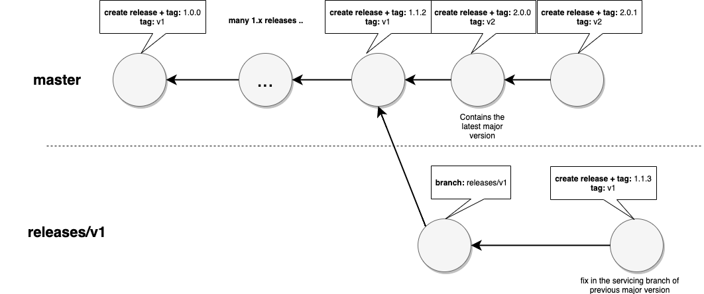

# Versioning

Actions are downloaded and run from the GitHub graph of repos.  The workflow references an action use a ref.

Examples:

```yaml
steps:
    - uses: actions/javascript-action@v1        # recommended. starter workflows use this
    - user: actions/javascript-action@v1.0.0    # if an action offers specific releases 
    - uses: actions/javascript-action@41775a4   # binding to a specific sha 
```

# Compatibility

Binding to a major version is the latest of that major version ( e.g. `v1` == "1.*" )

Major versions should guarentee compatibility.  A major version can add net new capabilities but should not break existing input compatibility or break existing workflows. 

Major version binding allows you to take advantage of bug fixes and critical functionality and security fixes.  The `master` branch has latest code and is unstable to bind to since a breaking new major version may first get implemented in master.  

> Warning: do not reference `master` since that is 

```yaml
steps:
    - uses: actions/javascript-action@master  # do not do this
```

Binding to the immutable sha1 may offer more reliability.  However, note that the hosted images toolsets (e.g. ubuntu-latest) move forward and if there is a tool breaking issue, actions may react with a patch to a major version to compensate so binding to a specific sha may prevent you from getting fixes.

> Recommendation: bind to major versions to get functionality and fixes but reserve binding to a specific release or sha as a mitigation strategy for unforseen breaks. 

# Recommendations

1. **Create a release branch for each major version**: For example, `releases\v1`.  This will allow for releases of that major major while development of a different major version proceeds.

2. **Validate changes referencing the release branch**:  

```yaml
steps:
    - uses: actions/sample-action@releases/v1
```

3. **Create a GitHub release for each specific version**: Creating a release like [ v1.0.0 ](https://github.com/actions/javascript-action/releases/tag/v1.0.0) allows users to bind back to a specific version if an issue is encoutered with the latest major version. 

4. **Release that version by updating the major version tag**: Move the major version tag (v1, v2, etc.) to point to the ref of the current release. This will act as the stable release for that major version. You should keep this tag updated to the most recent stable minor/patch release.

```
git checkout releases/v1
git tag -fa v1 -m "Update v1 tag"
git push origin v1 --force
```

This will results in a major version tag and the latest specific version pointing to the same sha.  See [javascript-action tags](https://github.com/actions/javascript-action/tags) as an example.

5. **Compatibility Breaks**:  introduce a new major version branch (releases/v2) and tag (v2) if changes will break existing workflows.  For example, changing inputs.

See [Git-Basics-Tagging](https://git-scm.com/book/en/v2/Git-Basics-Tagging)

# Sample Workflow

This illustrates one possible versioning workflow which the walk through covered.


