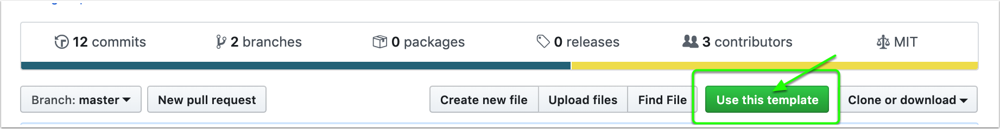

# Creating a Docker Action

The [container-template](https://github.com/actions/container-template) repo contains the base files to create a Docker action.

# Create a Repo from the Template

Navigate to https://github.com/actions/container-template

Click on `Use this template` to create the repo for your action.



Complete creating your repo and clone the repo.

> NOTE: The location of the repo will be how users will reference your action in their workflow file with the using keyword.

e.g. To use https://github.com/actions/setup-node, users will author:

```yaml
steps:
    using: actions/setup-node@v3
```

# Define Metadata

Your action has a name and a description.  Update the author.

Create inputs that your unit of work will need.  These will be what workflow authors set with the `with:` keyword.

```yaml
name: 'My Container Action'
description: 'Get started with Container actions'
author: 'GitHub'
inputs: 
  myInput:
    description: 'Input to use'
    default: 'world'
runs:
  using: 'docker'
  image: 'Dockerfile'
  args:
    - ${{ inputs.myInput }}
```

It will be run with docker and the input is mapped into the args

# Change Code

The entry point is in entrypoint.sh

```bash
#!/bin/sh -l

echo "hello $1"
```

# Publish 

Simply push your action to publish.

```bash
$ git push
```

The runner will download the action and build the docker container on the fly at runtime.

> Consider versioning your actions with tags.  See [versioning](/docs/action-versioning.md)


