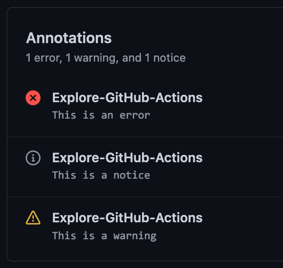

# `@actions/core`

> Core functions for setting results, logging, registering secrets and exporting variables across actions

## Usage

### Import the package

```js
// javascript
const core = require('@actions/core');

// typescript
import * as core from '@actions/core';
```

#### Inputs/Outputs

Action inputs can be read with `getInput` which returns a `string` or `getBooleanInput` which parses a boolean based on the [yaml 1.2 specification](https://yaml.org/spec/1.2/spec.html#id2804923). If `required` set to be false, the input should have a default value in `action.yml`.

Outputs can be set with `setOutput` which makes them available to be mapped into inputs of other actions to ensure they are decoupled.

```js
const myInput = core.getInput('inputName', { required: true });
const myBooleanInput = core.getBooleanInput('booleanInputName', { required: true });
const myMultilineInput = core.getMultilineInput('multilineInputName', { required: true });
core.setOutput('outputKey', 'outputVal');
```

#### Exporting variables

Since each step runs in a separate process, you can use `exportVariable` to add it to this step and future steps environment blocks.

```js
core.exportVariable('envVar', 'Val');
```

#### Setting a secret

Setting a secret registers the secret with the runner to ensure it is masked in logs.

```js
core.setSecret('myPassword');
```

#### PATH Manipulation

To make a tool's path available in the path for the remainder of the job (without altering the machine or containers state), use `addPath`.  The runner will prepend the path given to the jobs PATH.

```js
core.addPath('/path/to/mytool');
```

#### Exit codes

You should use this library to set the failing exit code for your action.  If status is not set and the script runs to completion, that will lead to a success.

```js
const core = require('@actions/core');

try {
  // Do stuff
}
catch (err) {
  // setFailed logs the message and sets a failing exit code
  core.setFailed(`Action failed with error ${err}`);
}
```

Note that `setNeutral` is not yet implemented in actions V2 but equivalent functionality is being planned.

#### Logging

Finally, this library provides some utilities for logging. Note that debug logging is hidden from the logs by default. This behavior can be toggled by enabling the [Step Debug Logs](../../docs/action-debugging.md#step-debug-logs).

```js
const core = require('@actions/core');

const myInput = core.getInput('input');
try {
  core.debug('Inside try block');
  
  if (!myInput) {
    core.warning('myInput was not set');
  }
  
  if (core.isDebug()) {
    // curl -v https://github.com
  } else {
    // curl https://github.com
  }

  // Do stuff
  core.info('Output to the actions build log')

  core.notice('This is a message that will also emit an annotation')
}
catch (err) {
  core.error(`Error ${err}, action may still succeed though`);
}
```

This library can also wrap chunks of output in foldable groups.

```js
const core = require('@actions/core')

// Manually wrap output
core.startGroup('Do some function')
doSomeFunction()
core.endGroup()

// Wrap an asynchronous function call
const result = await core.group('Do something async', async () => {
  const response = await doSomeHTTPRequest()
  return response
})
```

#### Annotations

This library has 3 methods that will produce [annotations](https://docs.github.com/en/rest/reference/checks#create-a-check-run). 
```js
core.error('This is a bad error, action may still succeed though.')

core.warning('Something went wrong, but it\'s not bad enough to fail the build.')

core.notice('Something happened that you might want to know about.')
```

These will surface to the UI in the Actions page and on Pull Requests. They look something like this:



These annotations can also be attached to particular lines and columns of your source files to show exactly where a problem is occuring. 

These options are: 
```typescript
export interface AnnotationProperties {
  /**
   * A title for the annotation.
   */
  title?: string

  /**
   * The name of the file for which the annotation should be created.
   */
  file?: string

  /**
   * The start line for the annotation.
   */
  startLine?: number

  /**
   * The end line for the annotation. Defaults to `startLine` when `startLine` is provided.
   */
  endLine?: number

  /**
   * The start column for the annotation. Cannot be sent when `startLine` and `endLine` are different values.
   */
  startColumn?: number

  /**
   * The end column for the annotation. Cannot be sent when `startLine` and `endLine` are different values.
   * Defaults to `startColumn` when `startColumn` is provided.
   */
  endColumn?: number
}
```

#### Styling output

Colored output is supported in the Action logs via standard [ANSI escape codes](https://en.wikipedia.org/wiki/ANSI_escape_code). 3/4 bit, 8 bit and 24 bit colors are all supported.

Foreground colors:

```js
// 3/4 bit
core.info('\u001b[35mThis foreground will be magenta')

// 8 bit
core.info('\u001b[38;5;6mThis foreground will be cyan')

// 24 bit
core.info('\u001b[38;2;255;0;0mThis foreground will be bright red')
```

Background colors:

```js
// 3/4 bit
core.info('\u001b[43mThis background will be yellow');

// 8 bit
core.info('\u001b[48;5;6mThis background will be cyan')

// 24 bit
core.info('\u001b[48;2;255;0;0mThis background will be bright red')
```

Special styles:

```js
core.info('\u001b[1mBold text')
core.info('\u001b[3mItalic text')
core.info('\u001b[4mUnderlined text')
```

ANSI escape codes can be combined with one another:

```js
core.info('\u001b[31;46mRed foreground with a cyan background and \u001b[1mbold text at the end');
```

> Note: Escape codes reset at the start of each line

```js
core.info('\u001b[35mThis foreground will be magenta')
core.info('This foreground will reset to the default')
```

Manually typing escape codes can be a little difficult, but you can use third party modules such as [ansi-styles](https://github.com/chalk/ansi-styles).

```js
const style = require('ansi-styles');
core.info(style.color.ansi16m.hex('#abcdef') + 'Hello world!')
```

#### Action state

You can use this library to save state and get state for sharing information between a given wrapper action:

**action.yml**:

```yaml
name: 'Wrapper action sample'
inputs:
  name:
    default: 'GitHub'
runs:
  using: 'node12'
  main: 'main.js'
  post: 'cleanup.js'
```

In action's `main.js`:

```js
const core = require('@actions/core');

core.saveState("pidToKill", 12345);
```

In action's `cleanup.js`:

```js
const core = require('@actions/core');

var pid = core.getState("pidToKill");

process.kill(pid);
```

#### OIDC Token

You can use these methods to interact with the GitHub OIDC provider and get a JWT ID token which would help to get access token from third party cloud providers.

**Method Name**: getIDToken()

**Inputs**

audience : optional

**Outputs**

A [JWT](https://jwt.io/) ID Token

In action's `main.ts`:
```js
const core = require('@actions/core');
async function getIDTokenAction(): Promise<void> {
  
   const audience = core.getInput('audience', {required: false})
   
   const id_token1 = await core.getIDToken()            // ID Token with default audience
   const id_token2 = await core.getIDToken(audience)    // ID token with custom audience
   
   // this id_token can be used to get access token from third party cloud providers
}
getIDTokenAction()
```

In action's `actions.yml`:

```yaml
name: 'GetIDToken'
description: 'Get ID token from Github OIDC provider'
inputs:
  audience:  
    description: 'Audience for which the ID token is intended for'
    required: false
outputs:
  id_token1: 
    description: 'ID token obtained from OIDC provider'
  id_token2: 
    description: 'ID token obtained from OIDC provider'
runs:
  using: 'node12'
  main: 'dist/index.js'
```

#### Filesystem path helpers

You can use these methods to manipulate file paths across operating systems.

The `toPosixPath` function converts input paths to Posix-style (Linux) paths.
The `toWin32Path` function converts input paths to Windows-style paths. These
functions work independently of the underlying runner operating system.

```js
toPosixPath('\\foo\\bar') // => /foo/bar
toWin32Path('/foo/bar') // => \foo\bar
```

The `toPlatformPath` function converts input paths to the expected value on the runner's operating system.

```js
// On a Windows runner.
toPlatformPath('/foo/bar') // => \foo\bar

// On a Linux runner.
toPlatformPath('\\foo\\bar') // => /foo/bar
```

#### Platform helper

Provides shorthands for getting information about platform action is running on.

```js
import { platform } from '@actions/core'

/* equals to a call of os.platform() */
platform.platform // 'win32' | 'darwin' | 'linux' | 'freebsd' | 'openbsd' | 'android' | 'cygwin' | 'sunos'

/* equals to a call of os.arch() */
platform.arch // 'x64' | 'arm' | 'arm64' | 'ia32' | 'mips' | 'mipsel' | 'ppc' | 'ppc64' | 'riscv64' | 's390' | 's390x'

/* common shorthands for platform-specific logic */
platform.isWindows // true
platform.isMacOS // false
platform.isLinux // false

/* run platform-specific script to get more details about the exact platform, works on Windows, MacOS and Linux */
const {
  name, // Microsoft Windows 11 Enterprise
  version, // 10.0.22621
} = await platform.getDetails()
```

#### Populating job summary

These methods can be used to populate a [job summary](https://docs.github.com/en/actions/using-workflows/workflow-commands-for-github-actions#adding-a-job-summary). A job summary is a buffer that can be added to throughout your job via `core.summary` methods.

Job summaries when complete must be written to the summary buffer file via the `core.summary.write()` method.

All methods except `addRaw()` utilize the `addRaw()` method to append to the buffer, followed by an EOL using the `addEOL()` method.

```typescript

// Write raw text, optionally add an EOL after the content, defaults to false
core.summary.addRaw('Some content here :speech_balloon:', true)
// Output: Some content here :speech_balloon:\n

// Add an operating system-specific end-of-line marker
core.summary.addEOL()
// Output (POSIX): \n
// Output (Windows): \r\n

// Add a codeblock with an optional language for syntax highlighting
core.summary.addCodeBlock('console.log(\'hello world\')', 'javascript')
// Output: <pre lang="javascript"><code>console.log('hello world')</code></pre>

// Add a list, second parameter indicates if list is ordered, defaults to false
core.summary.addList(['item1','item2','item3'], true)
// Output: <ol><li>item1</li><li>item2</li><li>item3</li></ol>

// Add a collapsible HTML details element
core.summary.addDetails('Label', 'Some detail that will be collapsed')
// Output: <details><summary>Label</summary>Some detail that will be collapsed</details>

// Add an image, image options parameter is optional, you can supply one of or both width and height in pixels
core.summary.addImage('example.png', 'alt description of img', {width: '100', height: '100'})
// Output: 

// Add an HTML section heading element, optionally pass a level that translates to 'hX' ie. h2. Defaults to h1
core.summary.addHeading('My Heading', '2')
// Output: <h2>My Heading</h2>

// Add an HTML thematic break <hr>
core.summary.addSeparator()
// Output: <hr>

// Add an HTML line break <br>
core.summary.addBreak()
// Output: <br>

// Add an HTML blockquote with an optional citation
core.summary.addQuote('To be or not to be', 'Shakespeare')
// Output: <blockquote cite="Shakespeare">To be or not to be</blockquote>

// Add an HTML anchor tag
core.summary.addLink('click here', 'https://github.com')
// Output: <a href="https://github.com">click here</a>

```

Tables are added using the `addTable()` method, and an array of `SummaryTableRow`.

```typescript

export type SummaryTableRow = (SummaryTableCell | string)[]

export interface SummaryTableCell {
  /**
   * Cell content
   */
  data: string
  /**
   * Render cell as header
   * (optional) default: false
   */
  header?: boolean
  /**
   * Number of columns the cell extends
   * (optional) default: '1'
   */
  colspan?: string
  /**
   * Number of rows the cell extends
   * (optional) default: '1'
   */
  rowspan?: string
}

```

For example

```typescript

const tableData = [
  {data: 'Header1', header: true},
  {data: 'Header2', header: true},
  {data: 'Header3', header: true},
  {data: 'MyData1'},
  {data: 'MyData2'},
  {data: 'MyData3'}
]

// Add an HTML table
core.summary.addTable([tableData])
// Output: <table><tr><th>Header1</th><th>Header2</th><th>Header3</th></tr><tr></tr><td>MyData1</td><td>MyData2</td><td>MyData3</td></tr></table>

```

In addition to job summary content, there are utility functions for interfacing with the buffer.

```typescript

// Empties the summary buffer AND wipes the summary file on disk
core.summary.clear()

// Returns the current summary buffer as a string
core.summary.stringify()

// If the summary buffer is empty
core.summary.isEmptyBuffer()

// Resets the summary buffer without writing to the summary file on disk
core.summary.emptyBuffer()

// Writes text in the buffer to the summary buffer file and empties the buffer, optionally overwriting all existing content in the summary file with buffer contents. Defaults to false.
core.summary.write({overwrite: true})
```